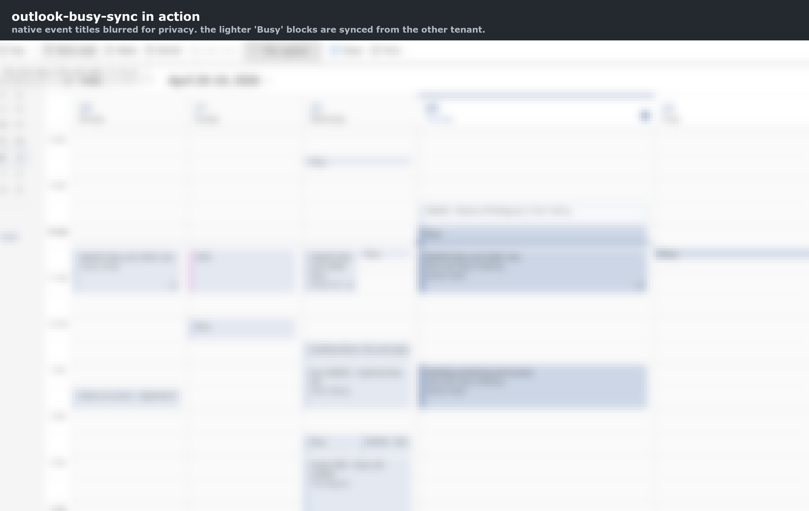

# outlook-busy-sync

Mirror busy blocks between two (or more) Microsoft 365 calendars without
exposing titles, attendees, or any meeting content.

Built for consultants, dual-employment situations, and anyone whose work
straddles two M365 tenants. Runs entirely locally - no SaaS, no third-party
cloud, no admin consent required in most tenants.

Supported platforms: **macOS, Linux, Windows** (amd64 + arm64 where
applicable). Single static Go binary, no runtime dependencies.



## TL;DR — zero to syncing in 60 seconds

```sh
# 1. install (macOS; see Install section below for Linux/Windows)
brew install michalkechner-impact/tap/outlook-busy-sync

# 2. scaffold a starter config
outlook-busy-sync init

# 3. edit ~/.config/outlook-busy-sync/config.yaml
#    - replace the two `email:` addresses
#    - (optional) rename `work` / `client` to whatever labels you like
#    - tenant_id stays `common` unless you know your tenant UUID

# 4. log in to each account (device-code flow, takes ~30s each)
outlook-busy-sync auth work
outlook-busy-sync auth client

# 5. preview before the first real run
outlook-busy-sync sync --dry-run

# 6. go live
outlook-busy-sync sync

# 7. keep it running every 15 minutes — see examples/scheduler/
```

> **Corporate tenant?** If `auth` fails with `AADSTS5019x` or "device not
> compliant", connect to the corporate VPN and retry. Most CA policies
> gate on trusted network location and clear once you're on the VPN.
>
> **Adding a third tenant (or more)?** Append another entry to
> `accounts:` and one `from`/`to` pair for each direction you want
> mirrored. The engine scales to N tenants - it just runs the pairs
> sequentially.

## Why this exists

Microsoft Exchange free/busy lookups are strictly per-tenant. When a
colleague in tenant A uses Scheduling Assistant, Exchange only queries
tenant A for your availability - it has no way to know about meetings in
tenant B. The official solutions (organisation federation, cross-tenant
calendar sharing) require coordinated admin changes in both tenants, which
is rarely viable for contractors or dual-employees.

`outlook-busy-sync` solves this by treating both tenants as peers: it reads
your events from each side and creates matching "Busy" blocks on the other,
so both colleagues and scheduling assistants see accurate availability.

## Features

- **Privacy-preserving**: copies `start`, `end`, and `showAs=busy` only.
  Event subjects are replaced with a configurable static title (default
  `Busy`). Bodies, locations, and attendees are never touched.
- **No app registration required**: uses a pre-approved Microsoft first-party
  client ID for device-code OAuth. Works in most enterprise tenants without
  involving IT. Override with your own registered app if needed.
- **Idempotent**: safe to run as often as you want; subsequent runs are
  no-ops unless something changed in the source.
- **Loop-proof**: synced events are tagged with a Graph extended property,
  so bidirectional configurations don't ping-pong.
- **Handles updates and cancellations**: moving a meeting on the source side
  moves the corresponding busy block; deleting it deletes the block.
- **Recurring events**: expanded via Graph's `calendarView` endpoint, so
  every instance in your sync window is mirrored individually.
- **Safe defaults**: all-day events (vacations, OOO, focus days) and
  declined invites are excluded by default, so your first run doesn't leak
  private patterns to the other tenant.
- **Cross-platform**: single static binary for macOS, Linux, and Windows.
  Tokens stored in the platform keyring (macOS Keychain, Windows Credential
  Manager, Secret Service on Linux), with a `0600` file fallback when the
  keyring is unavailable.

## Install

### macOS (Homebrew)

```sh
brew install michalkechner-impact/tap/outlook-busy-sync
```

> The Homebrew tap is published on the first tagged release. If the
> command above 404s, use **From source** below until the first release
> lands.

### Windows (Scoop)

```powershell
scoop bucket add michalkechner-impact https://github.com/michalkechner-impact/scoop-bucket
scoop install outlook-busy-sync
```

> Same caveat: the bucket is created by the first tagged release.

### Pre-built binaries

Grab the archive for your OS/arch from
[GitHub Releases](https://github.com/michalkechner-impact/outlook-busy-sync/releases).
Available archives:

- `outlook-busy-sync_<version>_darwin_{amd64,arm64}.tar.gz`
- `outlook-busy-sync_<version>_linux_{amd64,arm64}.tar.gz`
- `outlook-busy-sync_<version>_windows_amd64.zip`

Unpack and move the binary onto your `PATH`:

- **macOS / Linux:**
  ```sh
  tar -xzf outlook-busy-sync_*_linux_amd64.tar.gz
  install -m 0755 outlook-busy-sync ~/.local/bin/   # or /usr/local/bin
  ```

- **Windows:** extract the zip and copy `outlook-busy-sync.exe` into any
  folder on your `PATH` (for example `%USERPROFILE%\bin`).

### From source (any OS)

Requires Go 1.22+:

```sh
go install github.com/michalkechner-impact/outlook-busy-sync/cmd/outlook-busy-sync@latest
```

## Quickstart

### 1. Create config

```sh
outlook-busy-sync init
```

`init` writes a minimal starter config to the platform-default path and
prints what to do next. If a config already exists it leaves the file
alone. You can show the path at any time with `outlook-busy-sync config
path`:

| OS            | Default path                                                           |
|---------------|------------------------------------------------------------------------|
| macOS / Linux | `~/.config/outlook-busy-sync/config.yaml` (or `$XDG_CONFIG_HOME/...`)  |
| Windows       | `%APPDATA%\outlook-busy-sync\config.yaml`                              |

Open the file in your editor and edit the placeholders (account names,
emails). `tenant_id` is pre-filled with `common`, which works in the
majority of M365 setups without you looking up UUIDs - MSAL resolves the
real tenant during the device-code login. You can pin it to a specific
tenant UUID later if you need to.

**Finding your tenant UUID (optional)**: sign in to the account at
`https://portal.azure.com` and read it from the top-right profile panel,
or from the address bar after clicking "Microsoft Entra ID".

### 2. Validate the config

```sh
outlook-busy-sync config validate
```

### 3. Log in to each account

```sh
outlook-busy-sync auth work
outlook-busy-sync auth client
```

Each invocation prints a short code and URL. Open the URL in any browser,
sign in with the matching account, paste the code. Tokens are cached in
your OS keychain and refreshed automatically from then on.

> **Corporate tenants**: many enterprise M365 tenants are protected by
> Conditional Access policies that require the sign-in to originate from
> the corporate network or a compliant device. If `auth` fails with
> `AADSTS50199`, `AADSTS53003`, or a "device is not compliant" message,
> **connect to your company VPN first and retry**. For tenants where IT
> pins the policy to a managed laptop specifically, see the troubleshooting
> section below.

### 4. Run a sync

```sh
outlook-busy-sync sync
```

You should see log lines showing created/updated/deleted counts per pair.
Check both calendars - you should now see "Busy" blocks matching the other
side's meetings.

> **First run**: use `--dry-run` to preview every create/update/delete
> without actually writing to Graph. Recommended before scheduling, and
> whenever you change `skip_all_day` / `skip_declined` defaults (those
> flips re-classify previously-synced events, which then get deleted on
> the next real run).
>
> ```sh
> outlook-busy-sync sync --dry-run
> ```

### 5. Run it on a schedule

Platform-specific templates live under
[`examples/scheduler/`](examples/scheduler/):

| OS      | Backend                   | Template                                               |
|---------|---------------------------|--------------------------------------------------------|
| macOS   | launchd (user LaunchAgent) | [`examples/scheduler/macos/`](examples/scheduler/macos/) |
| Linux   | systemd user timer        | [`examples/scheduler/linux/`](examples/scheduler/linux/) |
| Windows | Task Scheduler            | [`examples/scheduler/windows/`](examples/scheduler/windows/) |

All three run `outlook-busy-sync sync` every 15 minutes as your normal
user, with no elevation.

## How sync works

Each configured pair is a one-way operation from a `from` account to a `to`
account. A bidirectional configuration is just two pairs with swapped
endpoints.

For one pair:

1. Fetch `from` events in the configured window using Graph's
   `/me/calendarView`, which expands recurring series into individual
   instances and returns only events that overlap the window.
2. Skip events that are cancelled, declined, explicitly free (`showAs=free`),
   or all-day (unless `skip_all_day: false`).
3. Skip events that carry our sync marker pointing back at the target
   account, so reverse-synced blocks do not re-mirror.
4. Fetch `to` events in the same window, indexed by our extended property
   (`SourceEventRef`). These are the events we previously created.
5. Diff: for each source event, ensure the `to` side has a matching block
   with identical start/end/title; create or update as needed. For each
   previously-created block whose source has disappeared, delete.

State lives entirely in Graph via the extended property - there is no local
database, so you can delete the binary and your tokens at any time without
orphaning sync artifacts (run `outlook-busy-sync sync` once more afterwards
from a fresh machine and it will reconcile).

## Security and privacy

- **Scopes**: the tool only requests `Calendars.ReadWrite` (delegated). It
  cannot read mail, files, Teams messages, or anyone else's calendar.
- **Token storage**:
  - macOS: Keychain (via `go-keyring`)
  - Windows: Credential Manager
  - Linux: Secret Service (GNOME Keyring / KWallet)
  - Fallback on all three: a `0600` file in your user config dir, used
    automatically when the keyring is unavailable or rejects the payload
    (the MSAL cache can exceed some keyring size limits).
- **Data flow**: all Graph API calls go directly from your machine to
  `graph.microsoft.com`. No events transit any intermediate service.
- **Pattern leakage**: note that although event content is never copied,
  the *timing* of your events on one tenant is visible in busy blocks on
  the other tenant's Exchange server. This is inherent to the approach -
  the entire point is for the other side's free/busy lookups to see those
  blocks. Do not use this tool if your meeting times themselves are
  sensitive and must not be inferrable from the other side.

## Configuration reference

See [`examples/config.yaml`](examples/config.yaml) for an annotated example.

Top-level fields:

| Field         | Type      | Notes                                                  |
|---------------|-----------|--------------------------------------------------------|
| `accounts`    | list      | One entry per M365 mailbox.                            |
| `sync_pairs`  | list      | One-way copies; add two for bidirectional.             |
| `defaults`    | map       | Fallbacks for any omitted `sync_pairs` fields.         |

Account fields:

| Field       | Required | Notes                                                          |
|-------------|----------|----------------------------------------------------------------|
| `name`      | yes      | Local identifier; used in `sync_pairs` and the `auth` command. |
| `email`     | no       | Shown in `status`; otherwise cosmetic.                         |
| `tenant_id` | yes      | Directory UUID, or `common` if unknown.                        |
| `client_id` | no       | Override the built-in Azure CLI public client ID.              |

Sync-pair fields:

| Field            | Required | Default |
|------------------|----------|---------|
| `from`, `to`     | yes      | -       |
| `lookback_days`  | no       | 1       |
| `lookahead_days` | no       | 30      |
| `title`          | no       | `Busy`  |
| `skip_all_day`   | no       | `true`  |
| `skip_declined`  | no       | `true`  |

To *include* all-day or declined events in the sync, set the override
inline on a specific pair (both fields accept an explicit `false`).

## Troubleshooting

**`AADSTS50020`, `AADSTS65001`, or similar consent error on `auth`.** Your
tenant has disabled user consent for the default Azure CLI client. Options:

1. Register your own app (Entra ID -> App registrations -> New registration:
   Mobile and desktop, redirect `http://localhost`, delegated permission
   `Calendars.ReadWrite`, allow personal Microsoft accounts). Set the
   resulting client UUID in the account's `client_id`.
2. Ask your tenant admin to grant tenant-wide consent for the Azure CLI
   app (`04b07795-8ddb-461a-bbee-02f9e1bf7b46`). Many tenants already have
   this consented globally for PowerShell tooling.

**`AADSTS50199`, `AADSTS53003`, or "device is not compliant".** Conditional
Access policies in the tenant are blocking the device-code flow from a
non-managed device or from outside the corporate network.

Try in order:

1. **Connect to corporate VPN and retry.** Many CA policies gate on
   "trusted network location" and clear on VPN. This is the single most
   common fix for consultants working from home or a coworking space.
2. Ask IT to allow device-code flow for the app (`Calendars.ReadWrite`
   scope), or grant tenant-wide consent for the Azure CLI client ID
   (`04b07795-8ddb-461a-bbee-02f9e1bf7b46`).
3. Use your own Azure app registration on a device that satisfies CA
   policies (usually a managed work laptop).
4. If the policy pins to a specific managed device, accept that this
   tenant cannot be used with the tool until one of the above is in place.

**`ErrLoginRequired` during `sync`.** The access token for that account has
been invalidated (password change, CA policy change, or the refresh token
aged out). Re-run `outlook-busy-sync auth <account>`.

**Events are not syncing.** Run with `-v` (`--verbose`) to see per-event
skip reasons. Common cases:

- You declined the source event, and `skip_declined` is `true` (default).
- The source event has `showAs=free` (always skipped; it's explicitly not
  a conflict).
- The event is an all-day event and `skip_all_day` is `true` (default).
  Set it to `false` on a specific pair if you want vacations mirrored.
- The sync window does not cover that date (`lookback_days`/`lookahead_days`).

**Duplicate busy blocks appeared.** Almost always means an earlier version
wrote events without the extended-property marker. Delete the stray blocks
manually; subsequent runs will create properly-tagged replacements.

**`status` shows an account as "NOT LOGGED IN" right after a successful
`auth`.** The MSAL cache was written to a location the process can't see
(e.g., different `HOME`/`XDG_CONFIG_HOME` between interactive shell and
scheduled task). Confirm with `outlook-busy-sync config path` in both
contexts that they resolve to the same directory.

## Development

```sh
git clone https://github.com/michalkechner-impact/outlook-busy-sync
cd outlook-busy-sync
make test     # run unit tests
make lint     # requires golangci-lint
make build    # produces bin/outlook-busy-sync
```

CI runs `go test` and `golangci-lint` on Linux, macOS, and Windows. See
[CONTRIBUTING.md](CONTRIBUTING.md) for more.

## License

MIT - see [LICENSE](LICENSE).
